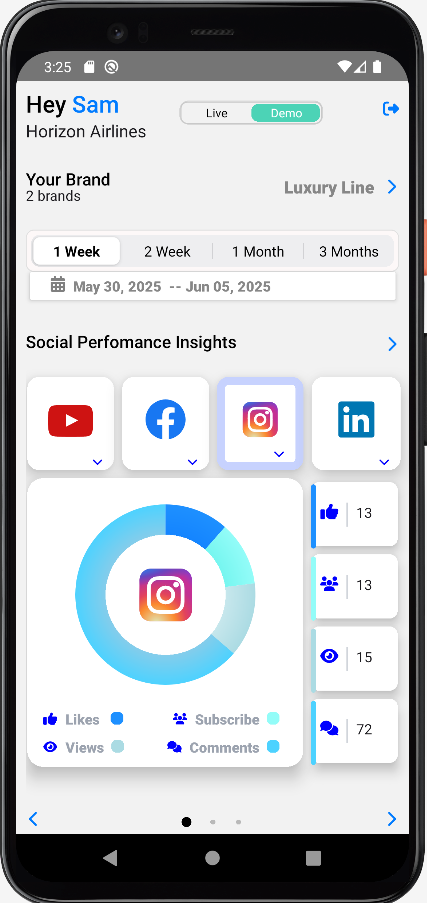
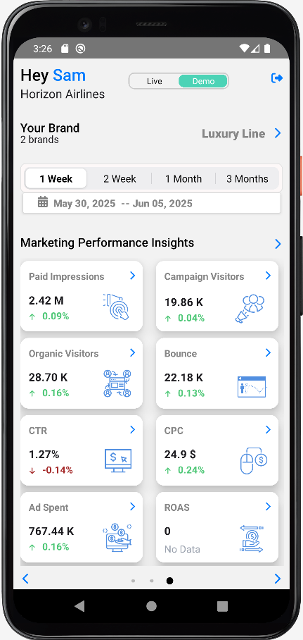
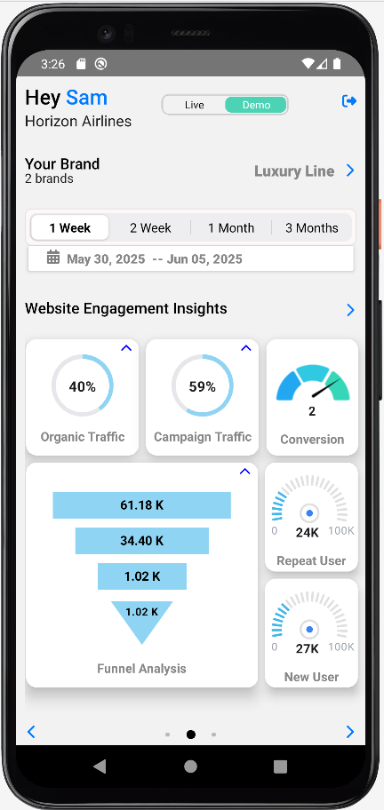

# 📱 Crigloo Mobile Dashboard App

> **Built using React Native** | End-to-end mobile analytics app for digital marketers  
> 🧠 **Solo Developer**  | 🔒 Auth + 🔌 API + 📊 Charts

---

## 🔍 Overview
Crigloo Mobile is a React Native app that allows digital marketing managers to monitor real-time ad performance across platforms (Google, Facebook, Instagram, LinkedIn, YouTube). It connects to the company’s AWS backend and visualizes KPIs, funnel metrics, and social engagement through a mobile-friendly dashboard.

---

## 🧭 Features
- 📊 **Marketing Summary** (Impressions, CTR, CPC, ROAS)
- 🔁 **Funnel Analysis** (New/Repeat Users, Bounce Rate, Conversions)
- 📣 **Social Media Performance** (Likes, Comments, Views, Subscribers)
- 📅 Time filter: 1 week, 2 weeks, 1 month, 3 months
- 📱 Optimized for mobile data scanning with a scrollable carousel UI

---

## 🏗️ Architecture
- **Component-based React Native App** using Hooks
- **Carousel-based dashboard** using `react-native-snap-carousel`
- **Navigation** via React Navigation
- **Charts** via `react-native-gifted-charts` and `chart-kit`
- **Global state** managed with Context API

---

## 🔐 Authentication
- Handled via **Amazon Cognito (AWS Amplify)**
- Token refresh check via `/check_access_token` API
- Local session stored in **AsyncStorage**

---

## 🔌 API Integration
- API calls made using **Axios**
- Auth: `Bearer <JWT>` + `x-api-key` in headers
- Environment-based config (`.env.*`) managed via `react-native-config`

---

## 🧩 Tech Stack

| Category            | Tools/Libraries                                        |
|---------------------|--------------------------------------------------------|
| UI Components       | NativeBase, React Native Paper                         |
| Charts              | react-native-gifted-charts, chart-kit                 |
| Forms & Validation  | react-hook-form, Yup                                   |
| Navigation          | react-navigation                                       |
| Auth & Tokens       | Amazon Cognito, aws-amplify, jwt-decode                |
| API Requests        | Axios                                                  |
| Animations          | Lottie                                                 |
| Alerts              | react-native-alert-notification                        |
| Local Storage       | AsyncStorage                                           |
| Analytics           | Firebase                                               |

---

## 📷 Screenshots


```md

[](./screenshots/Welcome-screen.png)




```


