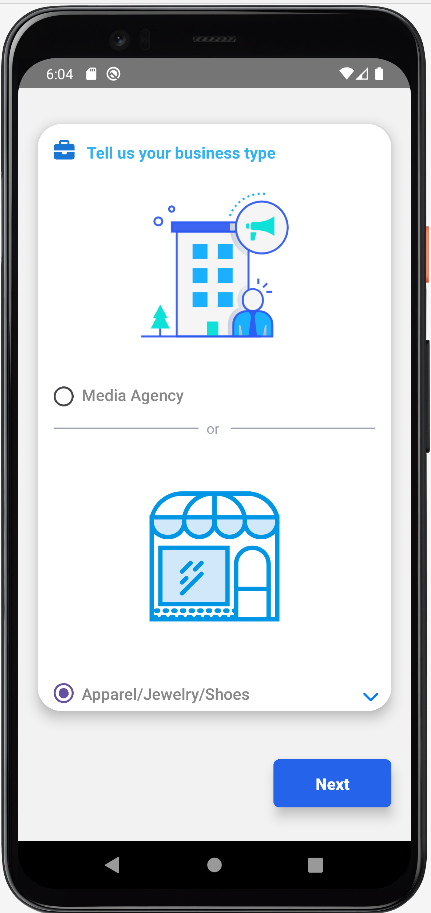
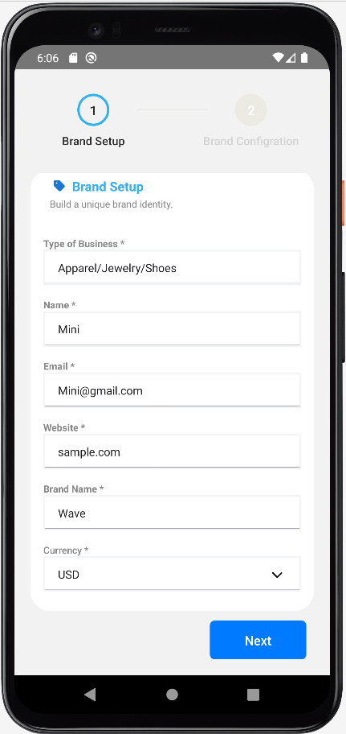
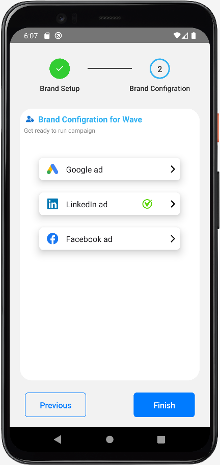

# 📱 Crigloo Mobile Dashboard App

> **Built using React Native** | End-to-end mobile analytics app for digital marketers  
> 🧠 **Solo Developer**  | 🔒 Auth + 🔌 API + 📊 Charts 

--- 

## 🔍 Overview
Crigloo Mobile is a React Native app that allows digital marketing managers to monitor real-time ad performance across platforms (Google, Facebook, Instagram, LinkedIn, YouTube). It connects to the company’s AWS backend and visualizes KPIs, funnel metrics, and social engagement through a mobile-friendly dashboard.

---
## 🔀 High-Level Flow

- Upon launching the app, users are greeted with a carousel-based welcome screen that highlights new product features. At any point, users can choose to skip the walkthrough and proceed directly by tapping the Login or Sign Up buttons displayed at the bottom.
- When a user logs in, their credentials are securely sent to Amazon Cognito for authentication. Upon successful login, the app receives an authentication token, which is then used to authorize subsequent API calls to fetch marketing and performance data.
- The retrieved data populates the dashboard, powering various piw charts and graphs across the app (e.g., campaign metrics, funnel analysis, and social performance).
- For returning users, the app stores their email locally to streamline the login experience and reduce friction.

---

## 🧭 Features
- 📊 **Marketing Summary** (Impressions, CTR, CPC, ROAS)
- 🔁 **Funnel Analysis** (New/Repeat Users, Bounce Rate, Conversions)
- 📣 **Social Media Performance** (Likes, Comments, Views, Subscribers)
- 📅 Time filter: 1 week, 2 weeks, 1 month, 3 months
- 📱 Optimized for mobile data scanning with a scrollable carousel UI

---

## 🏗️ Architecture
- **Component-based React Native App** using Hooks
- **Carousel-based dashboard** using `react-native-snap-carousel`
- **Navigation** via React Navigation
- **Charts** via `react-native-gifted-charts` and `chart-kit`
- **Global state** managed with Context API

---

## 🔐 Authentication
- Handled via **Amazon Cognito (AWS Amplify)**
- The app uses JWT (JSON Web Token) for authenticating users.
- Upon login, a valid ID Token is issued by Amazon Cognito
- Before every API request, the app checks if the token is expired:
- If token is not expired: It sends gets a new refresh token
- The backend validates the token and responds with refreshed credentials or success
- If token is expired: The user is logged out and redirected to the login screen.

---

## 🔌 Backend Communication 
 - The app interacts with a RESTful backend hosted on AWS, which provides data for marketing performance, funnel metrics, and social media insights.
 -	The backend is deployed in three separate environments:
      -	Alpha – used for internal testing and early development
      -	Beta – used for pre-production QA
      -	Production – used by real clients
 -	Environment-specific API endpoints are configured using the react-native-config library, with variables set in:
      -	.env.development
      -	.env.staging
      -	.env.production
 -	Based on which script (alpha, beta, or prod) is run at build time, the corresponding env API endpoint is loaded and all Axios requests route through that.

---

## 🔌 API Integration
- API calls made using **Axios**
- Auth: `Bearer <JWT>` + `x-api-key` in headers
- Environment-based config (`.env.*`) managed via `react-native-config`

---

## 🧩 Tech Stack

| Category            | Tools/Libraries                                        |
|---------------------|--------------------------------------------------------|
| UI Components       | NativeBase, React Native Paper                         |
| Charts              | react-native-gifted-charts, chart-kit                 |
| Forms & Validation  | react-hook-form, Yup                                   |
| Navigation          | react-navigation                                       |
| Auth & Tokens       | Amazon Cognito, aws-amplify, jwt-decode                |
| API Requests        | Axios                                                  |
| Animations          | Lottie                                                 |
| Alerts              | react-native-alert-notification                        |
| Local Storage       | AsyncStorage                                           |
| Analytics           | Firebase                                               |
| styling             | Twailwind                                              |

---

## 📷 Screenshots

### 🔐 Login Flow

  
  

---

### 🧭 Onboarding New Customers

  
  
  
  

---

### 📊 Dashboard Insights

  
  
  

